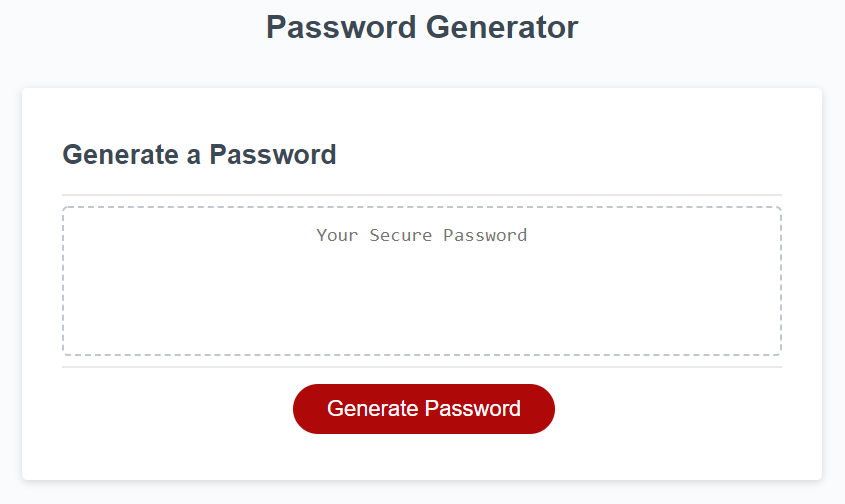

# Random Password Generator

## Description
A random password generator.
This program works by asking the user questions about the password they would like to create. Then based off the users answers, it adds components to empty arrays which correspond to character type. These are eventually combined into two arrays, "initialEight" and "passwordAddon".  "initialEight" ensures that if someone selects a lower numbered character (8 for example) with several options in character type, that those characters will ALWAYS appear in the password and wont be skipped on random chance. Then passwordAddon is added to the end of initialEight, and then cut to size to acheive the correct length the user requested. 

Page can be veiwed at https://kingbgreen5.github.io/random-pass/

## Installation
N/A

## Usage

Click the "Generate Password" Button, then select password length, and character type.

=======

## Credits
Starter code provided by bootcamp
Randomization function taken from W3 schools.

## License
MIT
